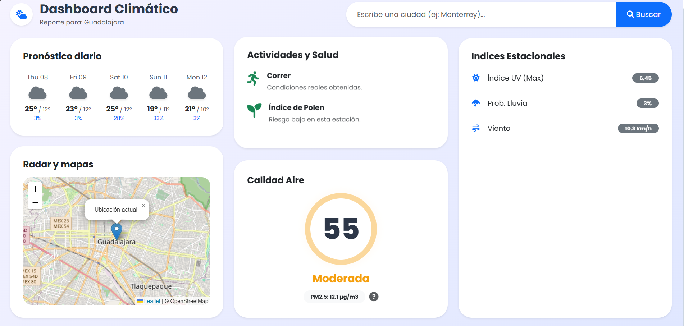

# Full Stack Weather Dashboard


Interactive web application that provides real-time meteorological and air quality data for any city in the world.



## ✨ Key Features

* **Global Search:** Locates any city using the OpenStreetMap API and automatically retrieves its coordinates.
* **Real-Time Weather:** Displays temperature, rain probability, and a 5-day forecast using the Open-Meteo API.
* **Air Quality (AQI):** Precise monitoring of **PM2.5** particles with a color-coded system (Good, Moderate, Unhealthy).
* **Interactive Map:** Integration with **Leaflet.js** to dynamically visualize the geographical location.
* **Educational Modal:** Interactive popup window explaining what PM2.5 particles are and their health risks.

## 🛠️ Technologies Used

### Backend

* **Python 3**
* **Flask**

### Frontend

* **HTML5 / CSS3**
* **JavaScript (ES6)**
* **Bootstrap 5**
* **Leaflet.js**
* **FontAwesome**

### APIs & Data

* **Open-Meteo API**: Weather and air quality data (No API Key required).
* **OpenStreetMap (Nominatim)**: Geocoding.

## 🚀 Installation and Usage

Follow these steps to run the project on your computer:

1. **Clone the repository:**

    ```bash
    git clone [https://github.com/YOUR_USER/YOUR_REPO.git](https://github.com/YOUR_USER/YOUR_REPO.git)
    cd YOUR_REPO
    ```

2. **Create and activate a virtual environment:**

    * Windows:

        ```bash
        python -m venv venv
        .\venv\Scripts\activate
        ```

    * Mac/Linux:

        ```bash
        python3 -m venv venv
        source venv/bin/activate
        ```

3. **Install dependencies:**

    ```bash
    pip install flask requests
    ```

4. **Run the application:**

    ```bash
    python app.py
    ```

5. **Open in browser:**

    The application should open automatically, or you can visit: `http://127.0.0.1:5000`

## 📂 Project Structure

```text
📂 weather-app
 ┣ 📂 static
 ┃ ┣ 📜 style.css       # Custom styles
 ┃ ┗ 📜 script.js       # Map logic and data updates
 ┣ 📂 templates
 ┃ ┗ 📜 index.html      # HTML structure and Modals
 ┣ 📜 app.py            # Flask Server (Routes)
 ┣ 📜 weather_service.py # API connection logic
 ┗ 📜 README.md
